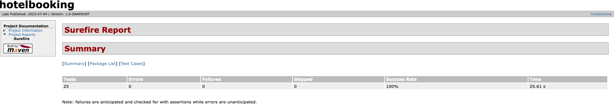

# HotelBooking

## Overview
* Test the hotel booking API's by verifying successful booking creation with valid input data.
* Validate the API's response for handling invalid or missing parameters during the hotel booking process.

## Pre-requisites for Setup Configuration
The following components are required to get started with automation:
* Install Java(JDK)
* Install IntelliJ/Eclipse
* Install Maven
* Configuring RestAssured with IntelliJ

## Getting Started
* Copy the repository into your local machine using the github url -> https://github.com/munisht7/HotelBooking.git.
* Checkout **main** branch for the latest changes.

## Built With
* Maven - Dependency management
* JUnit - Testing framework

## Defining the properties
* Properties can be configured in the **config.properties** file, refer to the path : **src/main/java/com/Automation/config/config.properties**
* For example, if you declare the following property in your config.properties file:
  `applicationUrl="https://restful-booker.herokuapp.com"`
  the property applicationUrl will be set.

## Directory structure
* src
   - main
     - java
       - com
         - Automation
           - base
             - BaseClassProvider (provides a base implementation or functionality for other classes to inherit or extend from)
             - BaseSetUp  (common setup)
           - config
             - config.properties (contains the applicationUrl for all the APi's)
           - constants
             - EndPoint ( contains the endpoints to be tested)
           - controllers
             - BookingController (handles the logic and operations related to booking functionality)
           - model
             - BaseModel (serves as a common base)
             - CreateBookingRequest (Getters and setters for creating booking request)
             - PartialUpdateBookingRequest (Getters and setters for Partial Update Booking Request )
           - util
             - ConfigReader (this file is for reading the configurations from config.properties)
             - CreateBooking (contains a method to return the bookingId after calling the create booking API)
             - GetAuth (contains a method to return the token to used for delete and partial update booking)
   - test
     - java
       - com
         - Automation
           - testCases
             - dataProvider
               - BookingDataProvider (contains method to read the yaml file and use it as dataProvider for data driven testing)
             - tests
               - CreateBookingTests (validating the happy and unhappy test cases for booking creation)
               - DeleteBookingTests ( contains test cases : 1.For deleting the booking  2.Cannot delete the booking without Auth Token)
               - GetBookingTests ( Get booking test cases : 1.Get Booking without filter 2.Get Booking with filter 3.Get Booking with first and last name 4.Checking the Get Booking with Other header types )
               - PartialUpdateBookingTests ( contains test cases : 1.For partial updating the booking  2.Cannot update the booking without Auth Token)

## Run tests locally
* Right click one of the feature files at **src/test/java/com/Automation/testCases/tests**
* Select **"Run"** or **"Debug"** to start the test

## Run tests using terminal
* Execute the test cases through terminal using maven by using the following command : **mvn test**

## Run the JUnit Test Cases
* Select **"Run"** or **"Debug"** to start the test

## Reporting
* Run **mvn site** command from the terminal. It will generate HTML reports in **target/site** directory
* Open the **surefire-report.html** file in the browser like shown below :

## Referred to the following links for the project

* JUnit Documentation : https://junit.org/junit5/docs/current/user-guide/
* Maven Download : https://maven.apache.org/download.cgi
* Maven Documentation : https://maven.apache.org/guides/
* API Documentation: http://restful-booker.herokuapp.com/apidoc/index.html#api-Booking-GetBookings
